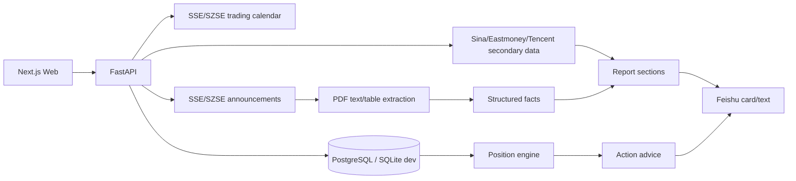

# 架构说明

`astock-watchtower` 分为四层：

1. Web UI：订阅配置、交易记录维护、手动分析。
2. API：账户内数据、订阅、交易记录、分析请求、飞书测试。
3. Analysis Engine：行情、技术指标、行业指标、市场天气、触发逻辑、输出结构。
4. Data Providers：交易所公告、行情、财报、行业数据、可选第三方数据源。

第一版先把 API、Web 和最小分析引擎跑通；数据源适配器以接口形式保留，方便后续替换。

## 订阅模式与分析模式

- 订阅模式：最多 3 只股票，有持仓上下文，有飞书推送，有定时任务。
- 分析模式：任意 A 股临时输入，不自动保存，不假设持仓。

## 数据质量标注

所有输出必须区分：

- Official：交易所、公司、监管机构官方来源。
- Secondary：新浪、腾讯、东方财富、Yahoo 等二级行情/资讯。
- Stale：数据存在但不是最新披露期。
- Missing：缺少可靠来源，不允许编造。

## 当前数据流

## 第一版边界

- 已接入规则化 PDF 正文/表格抽取，但不是完整会计报表解析器。
- 已接入行业指标映射，但行业专属字段仍以规则抽取为主，覆盖率会逐步扩展。
- 尚未接入大模型 API；当前摘要和建议主要是规则引擎生成。
- 不把 Public Equity Investing 插件作为运行时依赖；只借鉴其股市分析流程，包括官方披露优先、行业分层、验证链和 Missing/Stale 显式化。
